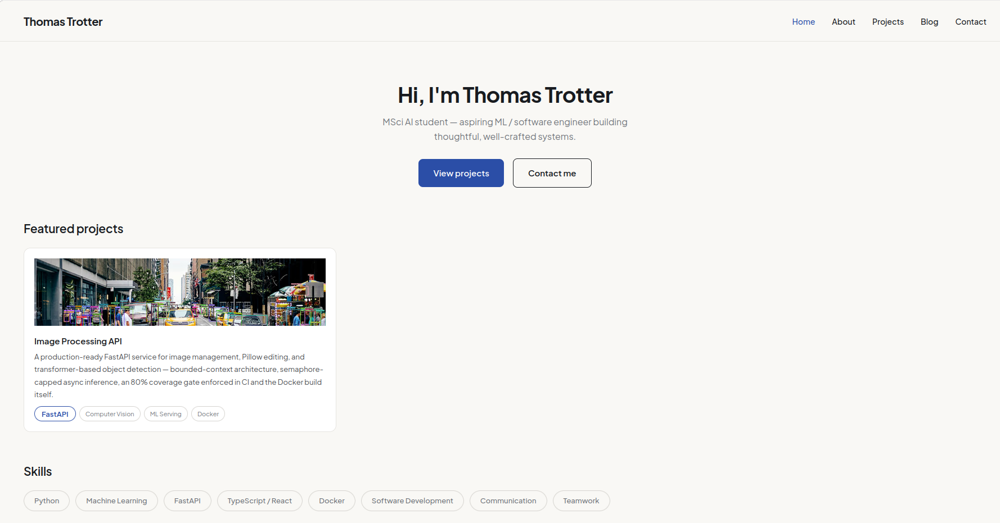

# Portfolio

Personal portfolio and blog for [Thomas Trotter](https://portfolio-thomas-trotter1.vercel.app) — built with Next.js 16, React 19, TypeScript, and a type-safe MDX content pipeline powered by [Velite](https://velite.js.org).



## Stack

| Layer | Tech |
|-------|------|
| Framework | Next.js 16 (App Router), React 19, TypeScript |
| Styling | Tailwind CSS 4, Plus Jakarta Sans + JetBrains Mono |
| Content | MDX + YAML, validated at build time with Velite + Zod |
| Email | Resend (contact form via Server Actions) |
| Deploy | Vercel |

## Architecture

Everything publishable lives under `content/` as files, not in components:

```
content/
  blog/         MDX posts (one folder per post)
  projects/     MDX project showcases
  pages/        about, contact copy
  site.yaml     global config — name, skills, links
```

At build time, Velite parses these into typed collections (`.velite/`) that the app imports like any other module. Frontmatter is validated with Zod — a missing field or broken image path fails the build instead of shipping a broken page. Images referenced in content are copied to `public/static/` with hashed filenames.

Dynamic routes (`/blog/[slug]`, `/projects/[slug]`) use `generateStaticParams` so every content page ships as static HTML.

## Getting started

**Prerequisites:** Node.js 20+

```bash
git clone https://github.com/thomas-trotter/portfolio.git
cd portfolio
npm install
cp .env.example .env.local   # fill in values below
npm run dev
```

Open [http://localhost:3000](http://localhost:3000). The dev server watches `content/` and rebuilds Velite collections on save.

### Environment variables

| Variable | Required | Description |
|----------|----------|-------------|
| `RESEND_API_KEY` | For contact form | API key from [Resend](https://resend.com) |
| `NEXT_PUBLIC_SITE_URL` | Production | Canonical site URL (e.g. `https://yoursite.vercel.app`) — used in OG tags, sitemap, and canonical URLs |

Set both in Vercel project settings before deploying.

### Scripts

```bash
npm run dev      # start dev server
npm run build    # production build (runs Velite + Next.js)
npm run start    # serve production build
npm run lint     # ESLint
```

## Adding content

**New project:** create `content/projects/<slug>/index.mdx` with an `assets/` folder. See an existing project for the frontmatter schema.

**New blog post:** create `content/blog/<slug>/index.mdx`. Velite validates images and frontmatter at build time.

**Site-wide data:** edit `content/site.yaml` (name, skills, social links).

## Further reading

The [blog post on building this site](./content/blog/building-this-portfolio/index.mdx) walks through the content-as-code decisions, Velite schemas, and the smaller choices (fonts, React Compiler, build-time image validation) in more detail.

## License

Private portfolio — all rights reserved.
