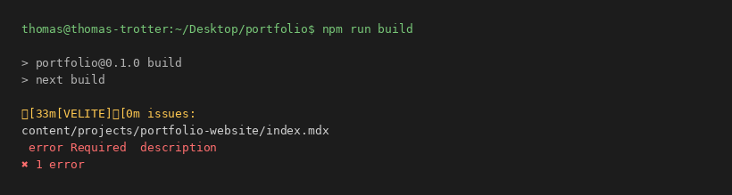
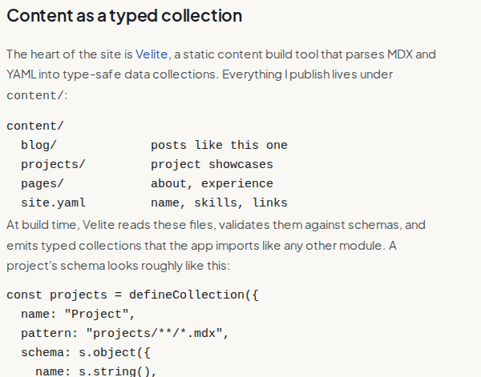

Every developer portfolio starts with the same uncomfortable question: how much infrastructure does a personal website actually deserve? A CMS felt like overkill for one author. Hardcoding pages in JSX felt like the opposite problem — every new project would mean writing components instead of writing *about the project*. What I actually wanted was somewhere in between: content that lives in the repository like code, gets reviewed like code, and fails the build like code when it's wrong.

This post is about how that turned out.

## The stack, briefly

The site is built with Next.js 16, React 19, and TypeScript, styled with Tailwind CSS 4, and deployed to Vercel. None of those choices is surprising, and that's deliberate — the interesting decisions all live in the content layer.

## Content as a typed collection

The heart of the site is [Velite](https://velite.js.org), a static content build tool that parses MDX and YAML into type-safe data collections. Everything I publish lives under `content/`:

```
content/
  blog/             posts like this one
  projects/         project showcases
  pages/            about, experience
  site.yaml         name, skills, links
```

At build time, Velite reads these files, validates them against schemas, and emits typed collections that the app imports like any other module. A project's schema looks roughly like this:

```ts
const projects = defineCollection({
  name: "Project",
  pattern: "projects/**/*.mdx",
  schema: s.object({
    name: s.string(),
    description: s.string(),
    tags: s.array(s.string()),
    featured: s.boolean().default(false),
    thumbnail: s.image().optional(),
    hero: s.image().optional(),
    code: s.mdx(),
  }),
});
```



The schemas are Zod under the hood, which changes the failure mode of the whole site. A missing description, a malformed date, or a misspelt field doesn't render as a subtly broken page — it fails the build with a precise error, before anything reaches production. For a site maintained by one person in spare evenings, "the build catches my mistakes" is worth more than any feature.

My favourite part is `s.image()`. Frontmatter images are declared as relative paths alongside the MDX file, and Velite verifies that the file exists, copies it to `public/static/`, and returns metadata. Broken image references — the most common way personal sites quietly rot — simply cannot ship.

## Rendering: collections in, pages out

On the Next.js side, the app router consumes those collections to generate everything. Dynamic routes handle individual posts and project pages, with `generateStaticParams` producing the full set of static parameters at build time, so every content page ships as static HTML. The home page is assembled the same way: hero details, the skills grid, and social links come from `site.yaml`, and the featured projects section is just a filter over the projects collection.

The payoff is a strict separation I've come to really like: components describe how things look, content describes what things say, and neither ever needs to know about the other. Publishing this post was a matter of dropping one `.mdx` file into `content/blog/` — the dev server watches the directory and rebuilds collections on save, so drafting happens with live preview.

## The smaller decisions

A few choices that individually seem minor but add up to how the site feels:

**Typography.** Plus Jakarta Sans for prose, JetBrains Mono for code and metadata. I wanted the site to read as personal rather than corporate, but still unmistakably an engineer's — the mono accents do that work.



**React Compiler.** Enabled from the start. Components get memoisation automatically, which mostly means the codebase stays free of `useMemo` and `useCallback` noise that exists purely to please the renderer.

**Contact form.** Resend for delivery, Zod for validation — the same validation philosophy as the content layer, applied to the one place users send data *in*.

**Conditional image slots.** Every image slot in the UI renders only when an image exists, with the hero doubling as the card thumbnail when no separate one is set. Content should degrade gracefully; a post without a cover is still a post.

## What I'd tell someone building their own

Put your content in the repo and type it. That single decision drove everything good about this build: writing feels like committing code, mistakes surface at build time rather than in production, and the entire site — words, images, structure — has a single source of truth with a history. The framework matters less than the contract.

There's more I want to do — an RSS feed, search across posts, maybe dark mode toggling that respects the reader rather than my preference. But the foundation is the part I'm confident in, and fittingly, you're reading the proof.

