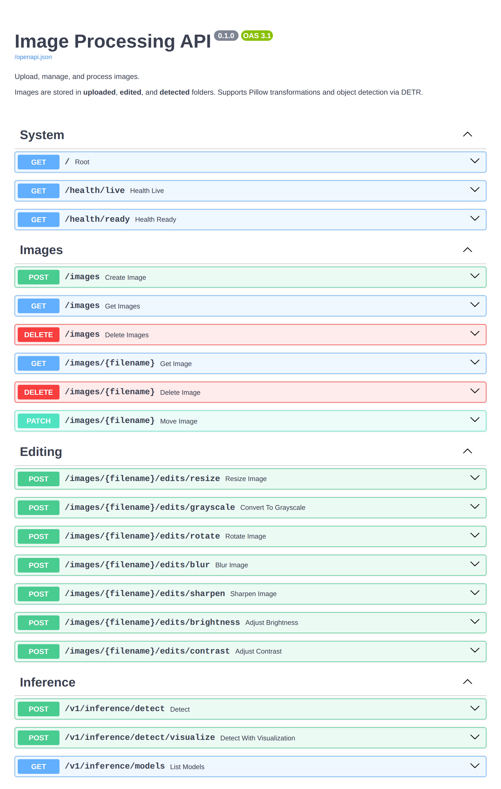
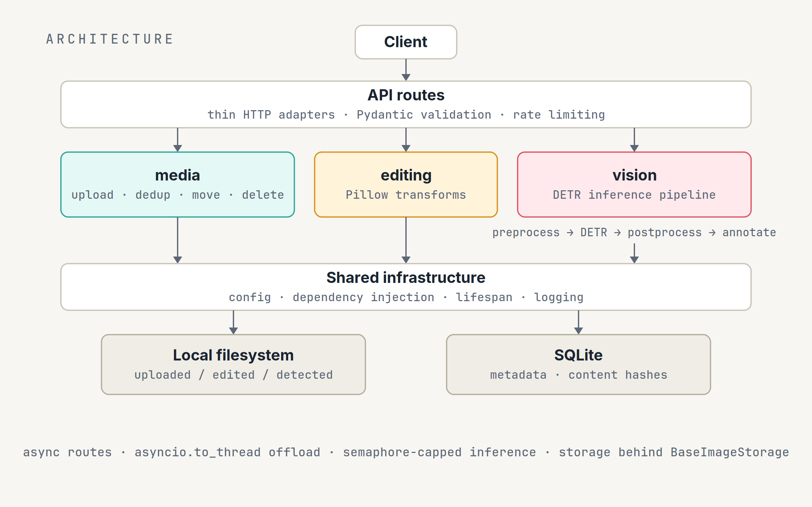
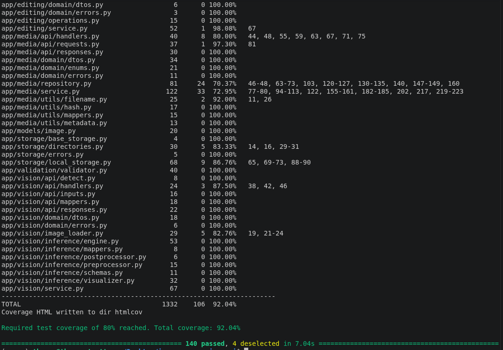

## Overview

A RESTful service that handles the full lifecycle of an image: upload, paginated listing, retrieval, moves between folders, and deletion; a suite of Pillow editing operations — resize, rotate, grayscale, blur, sharpen, brightness, and contrast; and transformer-based object detection that returns labelled bounding boxes with confidence scores, or the annotated image itself. Image bytes live on the filesystem while a SQLite catalogue tracks dimensions, format, and a content hash — so re-uploading identical bytes deduplicates to the existing record instead of writing a copy.

I built it to be more than a demo: it is rate-limited per endpoint, hardened against path traversal, logged, documented end-to-end (including ADRs that record key trade-offs), and deployable with a single Docker Compose command, ensuring that security best practices are integrated from development to deployment.



## Architecture

The codebase is organised into three bounded contexts — `media`, `editing`, and `vision` — each with the same internal shape: an API layer of Pydantic request/response models and exception handlers, a domain layer of plain DTOs and errors deliberately free of FastAPI or ORM imports, and a service layer that orchestrates the work. Thin route handlers delegate to these services through FastAPI's dependency injection, and each context's domain exceptions map to HTTP status codes via registered handlers, keeping error semantics consistent across the API. Incorporate monitoring and logging practices to enable operational visibility and facilitate troubleshooting.



Storage sits behind an abstract `BaseImageStorage` interface, so the local-disk backend could be swapped for cloud storage without touching business logic — a trade-off documented in an ADR alongside the migration path.

## Serving DETR in production

Detection is powered by DETR (`facebook/detr-resnet-50`), an end-to-end transformer detection model with a ResNeSt-50 backbone, loaded through Hugging Face Transformers. Rather than bolting a model onto a web app, the service treats inference as an operational concern: the model loads once at startup with an optional warmup pass, readiness is exposed at `/health/ready` for container orchestration, and confidence threshold, maximum image dimension, and device are all configurable through environment settings. Guide on how to replace or extend the detection model, including model selection and threshold tuning, to support different use cases.

Results come back as structured JSON — or as the annotated image shown at the top of this page:

```json
{
  "detections": [
    { "label": "person",  "score": 0.98, "box": [412, 128, 590, 655] },
    { "label": "bicycle", "score": 0.94, "box": [95, 402, 388, 641] },
    { "label": "dog",     "score": 0.91, "box": [640, 460, 812, 638] }
  ],
  "model": "facebook/detr-resnet-50"
}
```

## Performance & concurrency

Every route handler is asynchronous, and CPU-heavy work — Pillow transforms, filesystem I/O, and model inference — is pushed onto worker threads with `asyncio.to_thread`, so the event loop is never blocked. Because unbounded parallel inference would exhaust CPU and memory, detection runs behind an `asyncio` semaphore that caps concurrent forward passes, keeping latency predictable under load.


## Testing & delivery

149 tests across three tiers cover the service: a fast suite that mocks only the model weights while exercising real services, full-stack integration tests running against real SQLite and storage, and real-model inference smoke tests that download DETR and run on a nightly schedule. GitHub Actions runs linting (ruff), type checking (mypy), and the fast suite with an 80% coverage gate on every push — and the Docker build enforces the same gate, so an image cannot be produced from failing code — thereby separating development and production. Compose configurations ship with named volumes and readiness health checks, and documentation includes a quickstart, full API reference, architecture overview, and deployment and troubleshooting guides.

