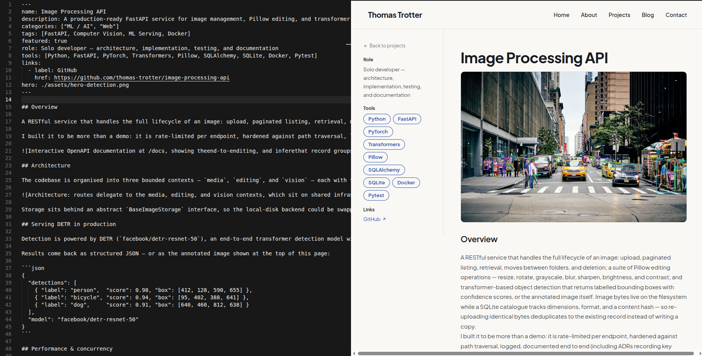
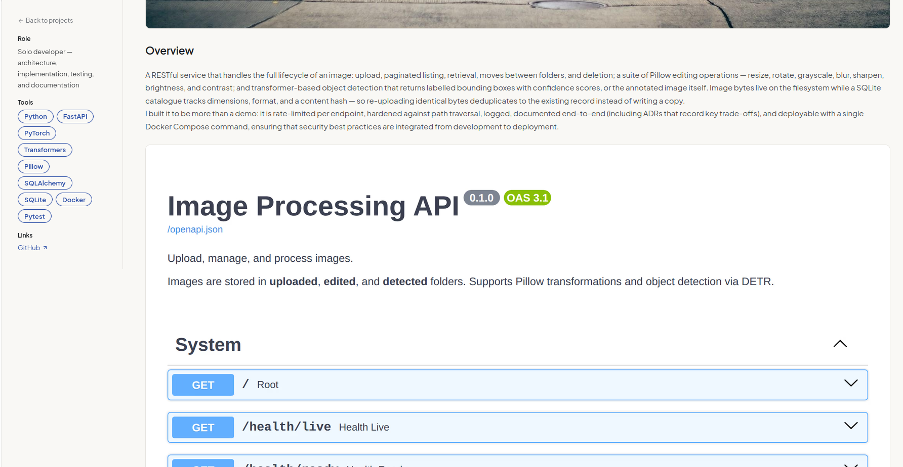

## Overview

A personal portfolio and blog with a content-first architecture: every project page, blog post, and content page — including the one you're reading — lives as an MDX file in the repository, parsed into type-safe collections at build time and rendered through Next.js dynamic routes. There is no CMS and no database; content is versioned alongside the code that renders it, reviewed in pull requests, and validated before it can ship.

The site runs on Next.js 16 with React 19 and TypeScript, styled with Tailwind CSS 4, and deploys to Vercel. Beyond the portfolio and blog, it includes an about page with skills and experience, and a contact form wired up with Resend and Zod validation.

## Content as data

The core of the architecture is Velite, which parses everything under `content/` into typed collections:

```
content/
  blog/             MDX blog posts with frontmatter
  projects/         MDX project showcases with metadata
  pages/            MDX content pages (about, contact)
  site.yaml         Global configuration — name, skills, links
```

Each collection has a Zod-powered schema, so frontmatter is not just parsed but *validated*: a project missing its description, a malformed date, or a typo in a field name fails the build rather than rendering a broken page. Images referenced in frontmatter go through Velite's `s.image()`, which checks the file exists at build time and copies it into `public/static/` — an entire class of broken-image bugs eliminated before deployment.

Global data follows the same philosophy. The home page's hero, featured projects, and skills grid are all sourced from `site.yaml` and the collections, so updating the site means editing content, never touching components.



## Design & rendering

Styling is Tailwind CSS 4 with a deliberate two-font stack: Plus Jakarta Sans for prose and headings, JetBrains Mono for code, metadata, and accents — a pairing chosen to read as both personal and unmistakably an engineer's site. Icons come from Lucide, and image slots throughout the UI render conditionally, so pages degrade gracefully when a post or project has no artwork.

React Compiler is enabled, so components get memoisation automatically without hand-scattered `useMemo` and `useCallback`, and content routes are statically generated at build time — pages ship as HTML with minimal client-side work.



## Workflow

Adding a project to the site is a two-step job: drop a new `.mdx` file with its `assets/` folder into `content/projects/`, and write. The dev server watches `content/` and rebuilds Velite's collections on change, so drafting happens with a live preview at `localhost:3000`; pushing to the release branch triggers a Vercel build, where linting, type checking, and content validation all stand between a typo and production.
